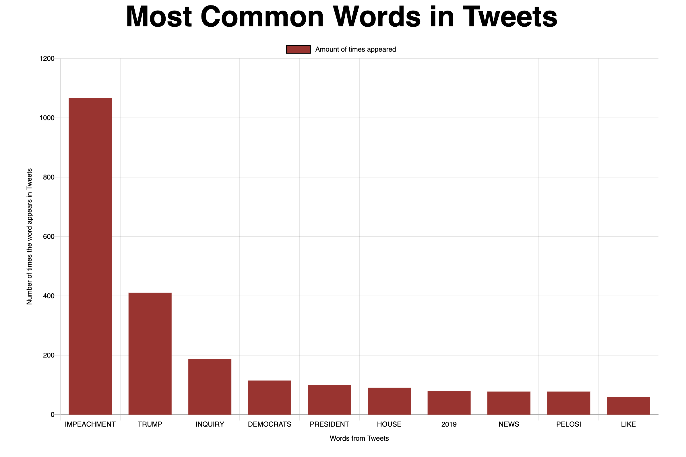
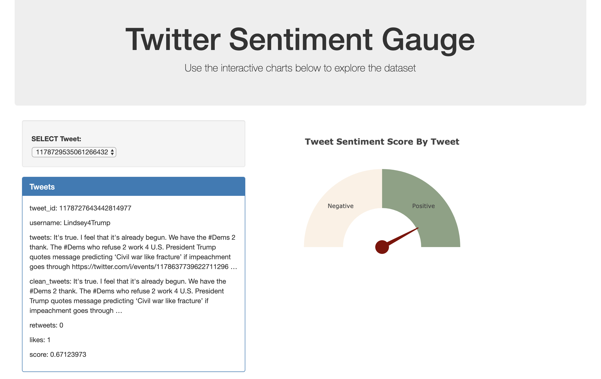
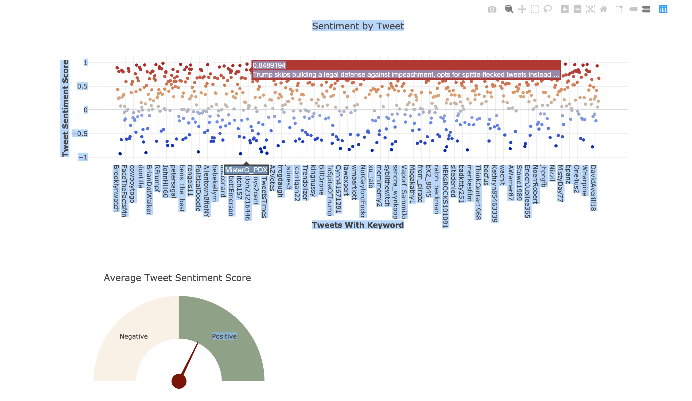
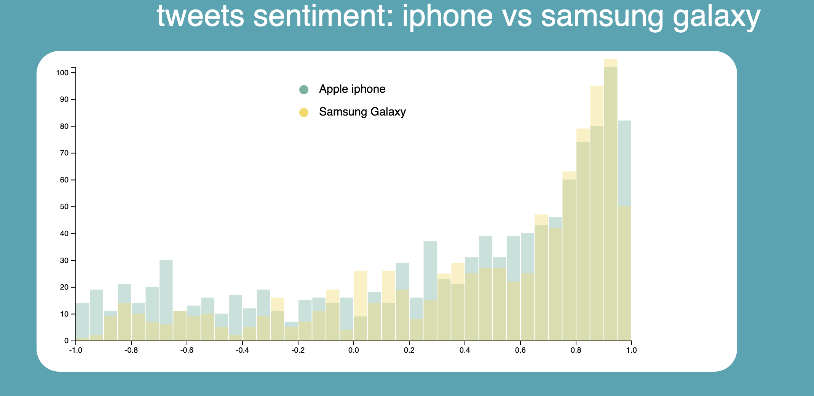
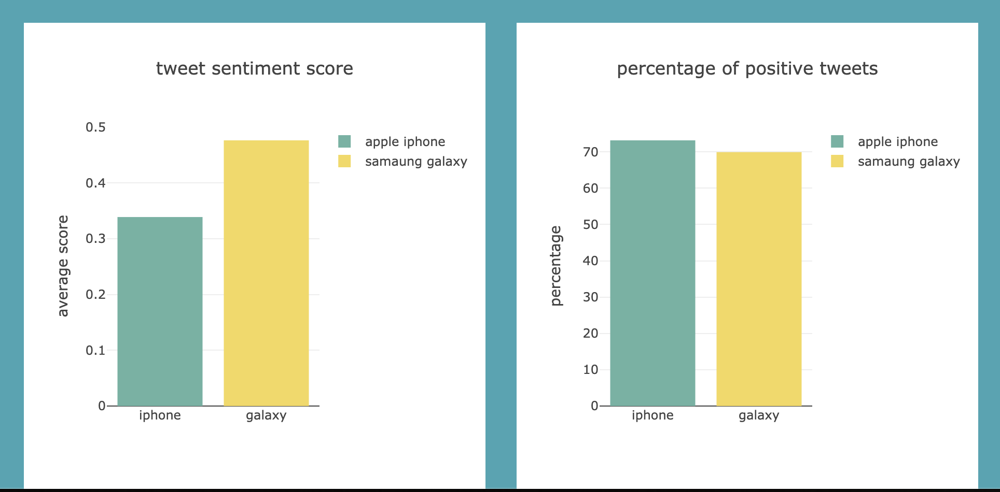
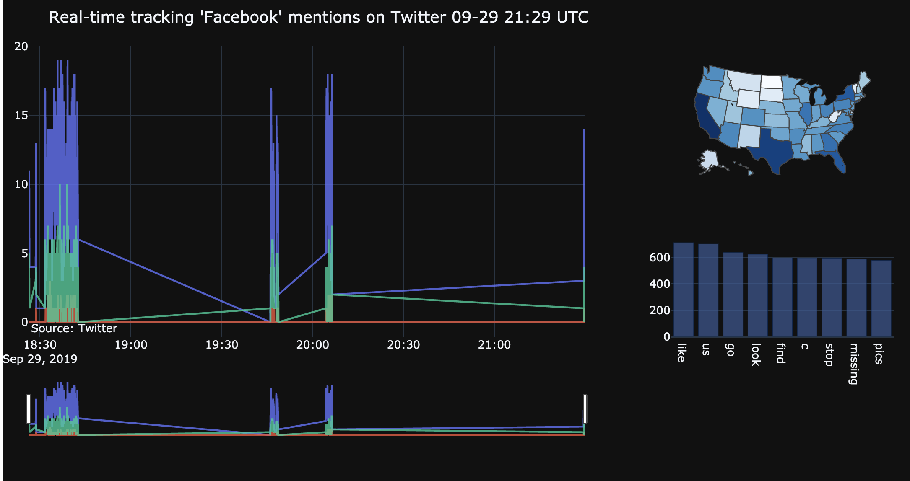

# twitter-sentimometer

* Twitter is the main soical media that people give their opinions on the social, polictical, and cultural events. To rapidly capture the sentiment of current evevnts on twitter, we used machine learning algorithm to predict the sentiment of each tweets of the most recent tweets. 

* Modeling
  * sources of training data: 1,600,000 tweets from http://help.sentiment140.com/for-students/
  * The methods we tried including: naive bayes, random forest(RF), long short-term memory(LSTM), gated recurrent unit(GRU) and convolutional neural network(CNN). While naive bayes and RF achived around 70% accuracy, all the deep learning model(LSTM, GRU and CNN) achieved accuary of over 80%. We chose CNN as the model for our prediction. 
  * The tweets are preprocessed to remove non-alphabetic character. The processed sentences are furtehr processed with removing stop words, stemming and lemmatization. For each steps the results are tested with the selected models. However, the results indicated that just removing non-alphabetic characters is already making model perform with over 80% accuracy. And further processing did not improve, and sometimes decrease accuracy. 
  * all the trials of machine learning model are stored in the folder model

* Visualization:
  * Search topics:
  
  enter the search topic in the bracket and then hit "Tweexplore!" button. It returns the most recent tweets about the topic up to 900 tweets, The results are saved in json file in the folder data. 

  * Most common words:
  
  The plot shows the most frequent words appearing in the tweets of the search topic.

  * Sentiment analysis
  
  Our CNN model predicts the sentiment of each tweets and returns a value range from -1 to 1, with -1 as the most negative sentiemnt and 1 as the most positive  sentiment. The tweet could be chosed by using the dropdown. The info of the tweet is shown in the info box and the score the the sentiemnt is shown in the gauge plot.
  
  The distribution of tweet sentiment scores from individual user are shown in the scatter plot. The gauge plot showed the average sentiment score from the 900 tweets we collected from the search.

  * Comparing results from different search topics.
  
  Results from different search are used for compaisrion. The histogram showed the distribution of tweets according to the sentiment scores. 
 
  
  The two bar charts showed the average score and the precentage of positive results from different search topics.

  * Live tweets seniment analsysis
  

    
